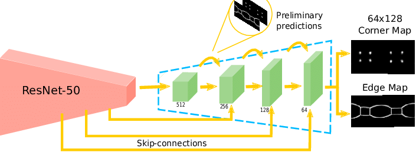
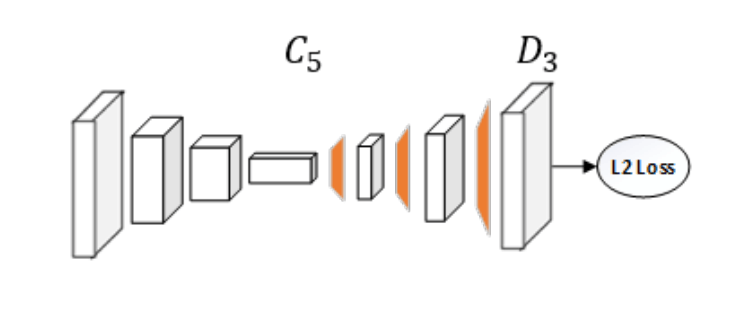

# Human-pose-Estimation
Pose Estimation is predicting the body part or joint positions of a person from an image or a video.

**Human Pose Estimation (HPE)** — an image processing task which finds the configuration of a subjects joints and body parts in an image. When tackling human pose estimation, we need to be able to detect a person in the image and estimate the configuration of his joins (or keypoints).

◉ It displays a persons orientation as a graphical representation. It is essentially a series of coordinates that can be joined to represent the pose of the person. In the skeleton, each coordinate is referred to as a part (or a joint, or a key-point). A valid connection between two parts is known as a pair (or a limb).

◉ The most used backbone network for extracting image features is ResNet. Simple Baselines for Human Pose Estimation and Tracking adds a few deconvolutional layers to the ResNets C5 final convolution stage as part of the approach.

They chose this structure because the state-of-the-art Mask R-CNN uses it and because it is arguably the simplest way to produce heatmaps from deep and low resolution information.

◉ The Bottom Up Approach will be used in our case, which involves identifying the body parts (joints, limbs, or little template patches) and then combining them to create our human body.
